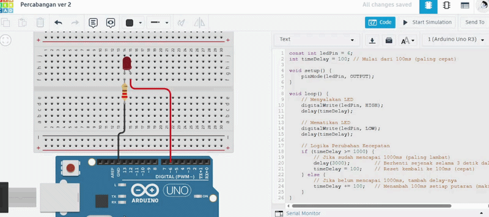

# Pertanyaan Praktikum
1. Pada kondisi apa program masuk ke blok if? 
2. Pada kondisi apa program masuk ke blok else? 
3. Apa fungsi dari perintah delay(timeDelay)? 
4. Jika program yang dibuat memiliki alur mati → lambat → cepat → reset (mati), ubah menjadi LED tidak langsung reset → tetapi berubah dari cepat → sedang → mati dan berikan penjelasan disetiap baris kode nya dalam bentuk README.md!

## Jawaban
1. Program masuk ke blok if saat nilai timeDelay mencapai 100 atau kurang. Ini berfungsi untuk memicu jeda panjang (3 detik) dan mereset kecepatan kedipan kembali ke awal (1000ms).
2. Program masuk ke blok else selama nilai timeDelay masih di atas 100. Di sini, program akan terus mengurangi nilai delay sebesar 100ms di setiap putaran agar kedipan LED semakin cepat.
3. Berfungsi untuk memberi jeda waktu (dalam milidetik) sesuai nilai variabel timeDelay. Perintah ini menentukan berapa lama LED tetap menyala atau mati, yang secara langsung mengatur kecepatan kedipan LED.
4. Program ini mengontrol kecepatan kedipan LED pada Pin 6 agar berubah dari lambat ke cepat, lalu kembali dari cepat ke lambat secara bertahap.

Kode Program

```cpp
const int ledPin = 6;
int timeDelay = 100; // Mulai dari 100ms (paling cepat)

void setup() {
    pinMode(ledPin, OUTPUT);
}

void loop() {
    // Menyalakan LED
    digitalWrite(ledPin, HIGH);
    delay(timeDelay);
    
    // Mematikan LED
    digitalWrite(ledPin, LOW);
    delay(timeDelay);

    // Logika Perubahan Kecepatan
    if (timeDelay >= 1000) {
        // Jika sudah mencapai 1000ms (paling lambat)
        delay(3000);        // Berhenti sejenak selama 3 detik dalam kondisi mati
        timeDelay = 100;    // Reset kembali ke 100ms (cepat)
    } else {
        // Jika belum mencapai 1000ms, tambah delay-nya
        timeDelay += 100;   // Menambah 100ms setiap putaran (makin lambat)
    }
}
```
