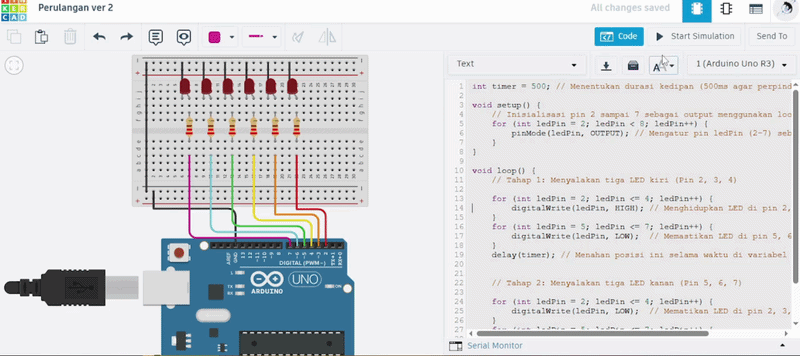

# Pertanyaan Praktikum
1. Gambarkan rangkaian schematic 5 LED running yang digunakan pada percobaan! 
2. Jelaskan bagaimana program membuat efek LED berjalan dari kiri ke kanan! 
3. Jelaskan bagaimana program membuat LED kembali dari kanan ke kiri!
4. Buatkan program agar LED menyala tiga LED kanan dan tiga LED kiri secara bergantian dan berikan penjelasan disetiap baris kode nya dalam bentuk README.md!

## Jawaban
1. Setiap LED disusun secara paralel dengan urutan:
 - Anoda (+): Terhubung ke Pin Digital Arduino (Pin 2 hingga Pin 7).
 - Katoda (-): Terhubung ke Resistor 220 $\Omega$, lalu ke Ground (GND).
2. Efek ini dihasilkan oleh perulangan for dengan logika penambahan (++):
 - Kode: ```for (int ledPin = 2; ledPin < 8; ledPin++)```
 - Cara Kerja: Program menyalakan LED satu per satu mulai dari nomor pin kecil ke besar (2 $\rightarrow$ 3 $\rightarrow$ 4 $\rightarrow$ 5 $\rightarrow$ 6 $\rightarrow$ 7). Secara fisik, ini menciptakan gerakan cahaya dari kiri ke kanan.
3. Efek ini dihasilkan oleh perulangan for dengan logika pengurangan (--):
 - Kode: ```for (int ledPin = 7; ledPin >= 2; ledPin--)```
 - Cara Kerja: Program menyalakan LED mulai dari nomor pin besar ke kecil (7 $\rightarrow$ 6 $\rightarrow$ 5 $\rightarrow$ 4 $\rightarrow$ 3 $\rightarrow$ 2). Secara fisik, arah cahaya akan tampak berbalik dari kanan kembali ke kiri.
4. Program ini mengontrol dua kelompok LED (3 kiri dan 3 kanan) untuk menyala secara bergantian menggunakan perulangan `for`.

Kode Program
```cpp
int timer = 500; // Menentukan durasi kedipan (500ms agar perpindahan terlihat jelas)

void setup() {
    // Inisialisasi pin 2 sampai 7 sebagai output menggunakan loop
    for (int ledPin = 2; ledPin < 8; ledPin++) {
        pinMode(ledPin, OUTPUT); // Mengatur pin ledPin (2-7) sebagai OUTPUT
    }
}

void loop() {
    // Tahap 1: Menyalakan tiga LED kiri (Pin 2, 3, 4)
    
    for (int ledPin = 2; ledPin <= 4; ledPin++) {
        digitalWrite(ledPin, HIGH); // Menghidupkan LED di pin 2, 3, dan 4
    }
    for (int ledPin = 5; ledPin <= 7; ledPin++) {
        digitalWrite(ledPin, LOW);  // Memastikan LED di pin 5, 6, dan 7 mati
    }
    delay(timer); // Menahan posisi ini selama waktu di variabel timer


    // Tahap 2: Menyalakan tiga LED kanan (Pin 5, 6, 7)
    
    for (int ledPin = 2; ledPin <= 4; ledPin++) {
        digitalWrite(ledPin, LOW);  // Mematikan LED di pin 2, 3, dan 4
    }
    for (int ledPin = 5; ledPin <= 7; ledPin++) {
        digitalWrite(ledPin, HIGH); // Menghidupkan LED di pin 5, 6, dan 7
    }
    delay(timer); // Menahan posisi ini selama waktu di variabel timer
}
```
