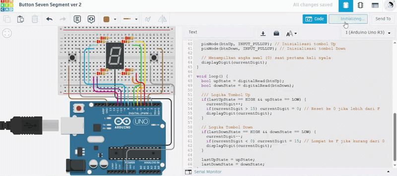

# Pertanyaan Praktikum
1. Gambarkan rangkaian schematic yang digunakan pada percobaan!
2. Mengapa pada push button digunakan mode INPUT_PULLUP pada Arduino Uno? Apa keuntungannya dibandingkan rangkaian biasa?
3. Jika salah satu LED segmen tidak menyala, apa saja kemungkinan penyebabnya dari sisi hardware maupun software?
4. Modifikasi rangkaian dan program dengan dua push button yang berfungsi sebagai penambahan (increment) dan pengurangan (decrement) pada sistem counter dan berikan penjelasan disetiap baris kode nya dalam bentuk README.md!

## Jawaban
1. Berikut adalah penggambaran schematic Button Seven Segment.\


2. Karena INPUT_PULLUP digunakan untuk mengaktifkan resistor internal dalam menjaga stabilitas sinyal (mencegah floating) dan menyederhanakan rangkaian tanpa perlu tambahan resistor fisik.
3. Bisa disebabkan oleh kerusakan komponen/kabel kendor (hardware) atau kesalahan pemetaan pin dan pola bit dalam kode (software).
4. Berikut adalah kode yang telah dimodifikasi untuk mendukung penambahan (increment) dan pengurangan (decrement).

Kode Program

```cpp
const int segmentPins[8] = {7, 6, 5, 10, 11, 8, 9, 4};
const int btnUp = 3;
const int btnDown = 2; // Menambah tombol Down di pin 2

byte digitPattern[16][8] = {
  {1,1,1,1,1,1,0,0}, //0
  {0,1,1,0,0,0,0,0}, //1
  {1,1,0,1,1,0,1,0}, //2
  {1,1,1,1,0,0,1,0}, //3
  {0,1,1,0,0,1,1,0}, //4
  {1,0,1,1,0,1,1,0}, //5 
  {1,0,1,1,1,1,1,0}, //6
  {1,1,1,0,0,0,0,0}, //7
  {1,1,1,1,1,1,1,0}, //8
  {1,1,1,1,0,1,1,0}, //9
  {1,1,1,0,1,1,1,0}, //A
  {0,0,1,1,1,1,1,0}, //b
  {1,0,0,1,1,1,0,0}, //C
  {0,1,1,1,1,0,1,0}, //d
  {1,0,0,1,1,1,1,0}, //E
  {1,0,0,0,1,1,1,0}  //F
};

int currentDigit = 0;
bool lastUpState = HIGH;
bool lastDownState = HIGH;

void displayDigit(int num) {
  for(int i=0; i<8; i++) {
    digitalWrite(segmentPins[i], !digitPattern[num][i]); 
  }
}

void setup() {
  // Semua pin output segmen
  for(int i = 0; i < 8; i++) {
    pinMode(segmentPins[i], OUTPUT);
  }
  
  pinMode(btnUp, INPUT_PULLUP); // Inisialisasi tombol Up
  pinMode(btnDown, INPUT_PULLUP); // Inisialisasi tombol Down

  // Menampilkan angka awal (0) saat pertama kali nyala
  displayDigit(currentDigit);
}

void loop() {
  bool upState = digitalRead(btnUp);
  bool downState = digitalRead(btnDown);

  /// Logika Tombol Up
  if(lastUpState == HIGH && upState == LOW) {
    currentDigit++;
    if(currentDigit > 15) currentDigit = 0; // Reset ke 0 jika lebih dari F
    displayDigit(currentDigit);
  }

  // Logika Tombol Down
  if(lastDownState == HIGH && downState == LOW) {
    currentDigit--;
    if(currentDigit < 0) currentDigit = 15; // Lompat ke F jika kurang dari 0
    displayDigit(currentDigit);
  }

  lastUpState = upState;
  lastDownState = downState;
}
```
