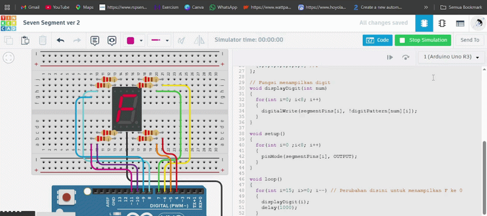

# Pertanyaan Praktikum
1. Gambarkan rangkaian schematic yang digunakan pada percobaan!
2. Apa yang terjadi jika nilai num lebih dari 15?
3. Apakah program ini menggunakan common cathode atau common anode? Jelaskan alasannya!
4. Modifikasi program agar tampilan berjalan dari F ke 0 dan berikan penjelasan disetiap baris kode nya dalam bentuk README.md!

## Jawaban
1. Berikut adalah penggambaran schematic Seven Segment.\

2. Jika nilai num lebih besar dari 15 (misalnya 16, 17, dst.), maka akan terjadi Array Out of Bounds (akses di luar batas array). Dalam bahasa C/C++ (dasar Arduino), array digitPattern didefinisikan dengan ukuran [16][8]. Jika program mencoba mengakses indeks ke-16 atau lebih, ia akan mengambil data dari alamat memori yang tidak seharusnya.
3. Program ini menggunakan jenis Common Anode (CA). Alasannya: Program ini menggunakan Common Anode karena penggunaan operator NOT (!) pada fungsi displayDigit menyebabkan segmen menyala saat pin Arduino mengirimkan sinyal LOW.
4. Berikut adalah kode yang telah dimodifikasi agar hitungan berjalan mundur dari F ke 0.

Kode Program

```cpp
//7-Segment Display (Efficient Version)
//Display 69 and AF

// Pin mapping segment
const int segmentPins[8] = {7, 6, 5, 10, 11, 8, 9, 4};
// a b c d e f g dp

// Segment pattern for e-F
// urutan segmen: a b c d e f g dp
byte digitPattern[16][8] = {
  {1,1,1,1,1,1,0,0}, //0
  {0,1,1,0,0,0,0,0}, //1
  {1,1,0,1,1,0,1,0}, //2
  {1,1,1,1,0,0,1,0}, //3
  {0,1,1,0,0,1,1,0}, //4
  {1,0,1,1,0,1,1,0}, //5 
  {1,0,1,1,1,1,1,0}, //6
  {1,1,1,0,0,0,0,0}, //7
  {1,1,1,1,1,1,1,0}, //8
  {1,1,1,1,0,1,1,0}, //9
  {1,1,1,0,1,1,1,0}, //A
  {0,0,1,1,1,1,1,0}, //b
  {1,0,0,1,1,1,0,0}, //C
  {0,1,1,1,1,0,1,0}, //d
  {1,0,0,1,1,1,1,0}, //E
  {1,0,0,0,1,1,1,0} //F
};

// Fungsi menampilkan digit
void displayDigit(int num)
{
  for(int i=0; i<8; i++)
  {
    digitalWrite(segmentPins[i], !digitPattern[num][i]);
  }
}

void setup()
{
  for(int i=0 ;i<8; i++)
  {
    pinMode(segmentPins[i], OUTPUT);
  }
}

void loop()
{
  for(int i=15; i>=0; i--) // Perubahan disini untuk menampilkan F ke 0
  {
    displayDigit(i);
    delay(1000);
  }
}
```
