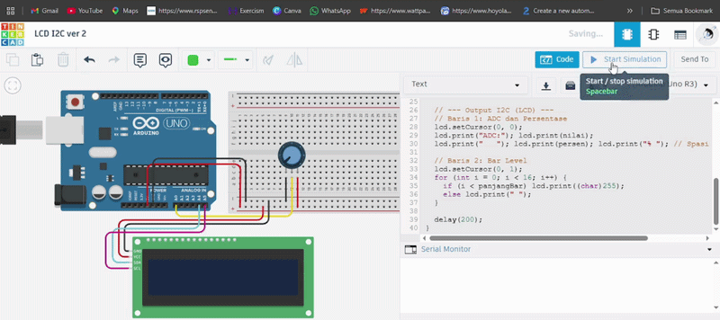

# Pertanyaan Praktikum
1. Jelaskan bagaimana cara kerja komunikasi I2C antara Arduino dan LCD pada rangkaian tersebut! 
2. Apakah pin potensiometer harus seperti itu? Jelaskan yang terjadi apabila pin kiri dan pin kanan tertukar! 
3. Modifikasi program dengan menggabungkan antara UART dan I2C (keduanya sebagai output) sehingga:
    - Data tidak hanya ditampilkan di LCD tetapi juga di Serial Monitor
    - Adapun data yang ditampilkan pada Serial Monitor sesuai dengan table berikut:\
    \
    Tampilan jika potensiometer dalam kondisi diputar paling kiri
    - ADC: 0 0% | setCursor(0, 0) dan Bar (level) | setCursor(0, 1)
    - Berikan penjelasan disetiap baris kode nya dalam bentuk README.md!
4. Lengkapi table berikut berdasarkan pengamatan pada Serial Monitor
    |ADC|Volt (V)|Persen (%)|
    |:---:|:---:|:---:|
    |1| | |
    |21| | |
    |49| | |
    |74| | |
    |96| | |

## Jawaban
1. Menggunakan dua jalur kabel utama: SDA (Serial Data) untuk mengirim data dan SCL (Serial Clock) untuk sinkronisasi waktu. Arduino bertindak sebagai Master yang mengirimkan alamat khusus (misal: 0x27) ke jalur bus. Modul I2C pada LCD yang memiliki alamat tersebut akan merespons sebagai Slave. Setelah koneksi terjalin, Arduino mengirimkan data teks atau perintah kontrol ke LCD secara berurutan bit-demi-bit melalui kabel SDA sesuai dengan detak jam dari SCL.
2. Jika pin kiri (VCC/5V) dan pin kanan (GND) tertukar, maka arah putaran potensiometer akan terbalik. Jika biasanya memutar ke kanan (searah jarum jam) membuat nilai ADC naik, setelah tertukar, memutar ke kanan justru akan membuat nilai ADC mengecil menuju nol. Secara teknis tidak merusak komponen, hanya merubah arah pembacaan nilai.
3. Berikut perubahan kodenya:

Kode Program

```cpp
#include <Wire.h>
#include <LiquidCrystal_I2C.h>

LiquidCrystal_I2C lcd(0x27, 16, 2);
const int pinPot = A0;

void setup() {
  Serial.begin(9600);
  lcd.init();
  lcd.backlight();
}

void loop() {
  int nilai = analogRead(pinPot);
  
  // Perhitungan Volt dan Persentase
  float volt = (nilai / 1023.0) * 5.0;
  int persen = map(nilai, 0, 1023, 0, 100);
  int panjangBar = map(nilai, 0, 1023, 0, 16);

  // --- Output UART (Serial Monitor) ---
  Serial.print("ADC: "); Serial.print(nilai);
  Serial.print(" | Volt: "); Serial.print(volt); Serial.print(" V");
  Serial.print(" | Persen: "); Serial.print(persen); Serial.println("%");

  // --- Output I2C (LCD) ---
  // Baris 1: ADC dan Persentase
  lcd.setCursor(0, 0);
  lcd.print("ADC:"); lcd.print(nilai);
  lcd.print("   "); lcd.print(persen); lcd.print("% "); // Spasi untuk clear sisa

  // Baris 2: Bar Level
  lcd.setCursor(0, 1);
  for (int i = 0; i < 16; i++) {
    if (i < panjangBar) lcd.print((char)255);
    else lcd.print(" ");
  }

  delay(200);
}
```

\

4. Tabel Pengamatan
    |ADC|Volt (V)|Persen (%)|
    |:---:|:---:|:---:|
    |1|0.005 V|0.10 %|
    |21|0.103 V|2.05 %|
    |49|0.239 V|4.79 %|
    |74|0.362 V|7.23 %|
    |96|0.469 V|9.38 %|