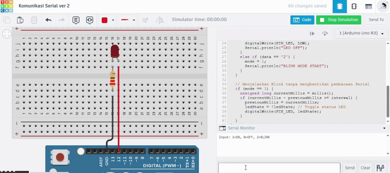

# Pertanyaan Praktikum
1. Jelaskan proses dari input keyboard hingga LED menyala/mati!
2. Mengapa digunakan Serial.available() sebelum membaca data? Apa yang terjadi jika baris tersebut dihilangkan?
3. Modifikasi program agar LED berkedip (blink) ketika menerima input '2' dengan kondisi jika ‘2’ aktif maka LED akan terus berkedip sampai perintah selanjutnya diberikan dan berikan penjelasan disetiap baris kode nya dalam bentuk README.md!
4. Tentukan apakah menggunakan delay() atau milis()! Jelaskan pengaruhnya terhadap sistem!

## Jawaban
1. Data dari keyboard dikirim melalui Serial Monitor ke buffer Arduino, lalu dibaca oleh fungsi Serial.read() untuk dieksekusi menjadi perintah digitalWrite (HIGH/LOW) pada pin LED.
2.Fungsi ini memastikan ada data di buffer sebelum dibaca. Jika dihilangkan, Serial.read() akan terus mengambil nilai kosong (-1) di setiap siklus perulangan dan bisa mengacaukan logika program.
3. Berikut program yang sudah di modifikasi agar terus berkedip ketika menerima input 2.

Kode Program

```cpp
const int PIN_LED = 12;
int mode = 0; // 0: Manual, 1: Blink
unsigned long previousMillis = 0;
const long interval = 500; // Kecepatan kedip (ms)
int ledState = LOW;

void setup() {
  Serial.begin(9600);
  Serial.println("Input: 1=ON, 0=OFF, 2=BLINK");
  pinMode(PIN_LED, OUTPUT);
}

void loop() {
  if (Serial.available() > 0) {
    char data = Serial.read();
    
    if (data == '1') {
      mode = 0;
      digitalWrite(PIN_LED, HIGH);
      Serial.println("LED ON");
    } 
    else if (data == '0') {
      mode = 0;
      digitalWrite(PIN_LED, LOW);
      Serial.println("LED OFF");
    } 
    else if (data == '2') {
      mode = 1;
      Serial.println("BLINK MODE START");
    }
  }

  // Menjalankan Blink tanpa menghentikan pembacaan Serial
  if (mode == 1) {
    unsigned long currentMillis = millis();
    if (currentMillis - previousMillis >= interval) {
      previousMillis = currentMillis;
      ledState = !ledState; // Toggle status LED
      digitalWrite(PIN_LED, ledState);
    }
  }
}
```

\
4. Lebih baik menggunakan millis. Karena jika menggunakan fungsi delay(), akan terjadi Blocking dimana Arduino akan menghentikan seluruh aktivitas prosesor dan hanya "menunggu" sampai waktu habis. Jika menggunakan millis(), akan terjadi Non-Blocking, dimana Arduino tetap menjalankan perintah lain dalam perulangan loop() secara terus-menerus. Fungsi millis() hanya mengecek apakah selisih waktu saat ini dengan waktu sebelumnya sudah mencapai target.